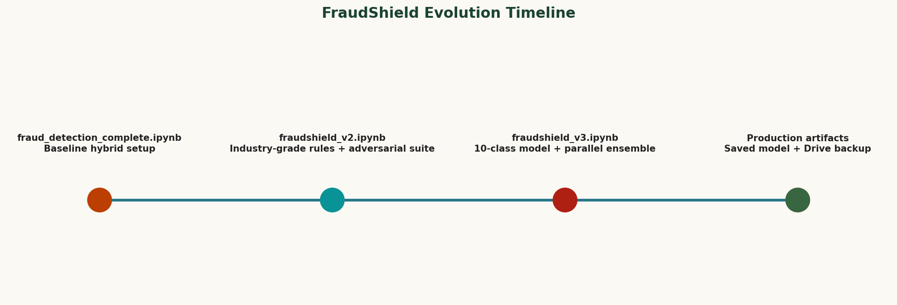
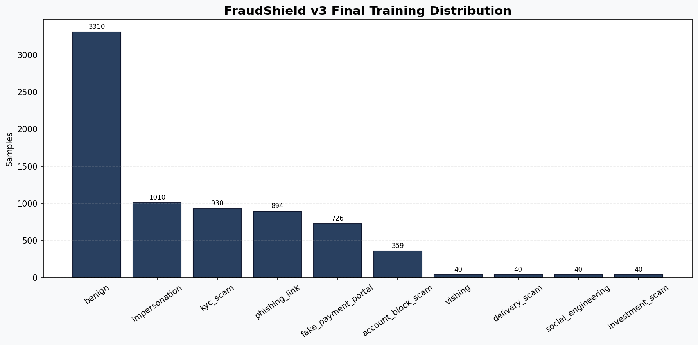
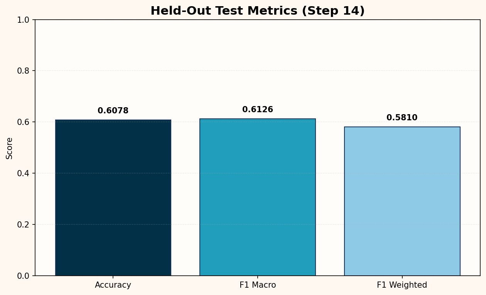
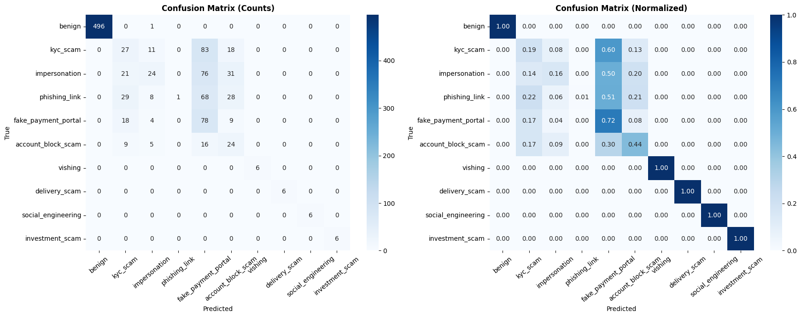

# FraudShield: Advanced Fraud Detection System (ISEA Hackathon)

<p align="center">
  
</p>

<p align="center">
  <a href="https://colab.research.google.com/github/Ns81000/fraud-detection-system/blob/main/fraud_detection_complete.ipynb" target="_blank">
    
  </a>
  <a href="https://colab.research.google.com/github/Ns81000/fraud-detection-system/blob/main/fraudshield_v2.ipynb" target="_blank">
    
  </a>
  <a href="https://colab.research.google.com/github/Ns81000/fraud-detection-system/blob/main/fraudshield_v3.ipynb" target="_blank">
    
  </a>
</p>

<p align="center">
  <a href="https://colab.research.google.com/github/Ns81000/fraud-detection-system/blob/main/fraudshield_server.ipynb" target="_blank">
    
  </a>
  <a href="https://ns81000.github.io/fraud-detection-system/" target="_blank">
    
  </a>
</p>

<p align="center">
  <a href="https://drive.google.com/drive/folders/1C_P7bjhV2n9y06PL78LqwUyoSrUq9BBI?usp=drive_link" target="_blank">
    
  </a>
</p>

## Table of Contents

- [Project Overview](#project-overview)
- [Why This Project Matters](#why-this-project-matters)
- [Notebook Access (Colab)](#notebook-access-colab)
- [Trained Models](#trained-models)
- [System Architecture](#system-architecture)
- [Design Goals](#design-goals)
- [Repository Structure](#repository-structure)
- [Key Technical Stack](#key-technical-stack)
- [Data Strategy Summary](#data-strategy-summary)
- [Evolution Journey](#evolution-journey)
- [Notebook Delta by Version](#notebook-delta-by-version)
- [Technical Walkthrough of fraudshield_v3.ipynb](#technical-walkthrough-of-fraudshield_v3ipynb)
- [Inference Server Notebook Analysis (fraudshield_server.ipynb)](#inference-server-notebook-analysis-fraudshield_serveripynb)
- [Frontend Analysis (index.html)](#frontend-analysis-indexhtml)
- [Performance Snapshot](#performance-snapshot)
- [Failure Modes and Observations](#failure-modes-and-observations)
- [Hybrid Inference Decision Flow](#hybrid-inference-decision-flow)
- [How to Reproduce](#how-to-reproduce)
- [Model Artifacts](#model-artifacts)
- [Reproducing the Visual Assets](#reproducing-the-visual-assets)
- [Production Notes](#production-notes)
- [Final Achievements](#final-achievements)
- [Roadmap](#roadmap)
- [Quick Access](#quick-access)

## Project Overview
FraudShield is a hybrid fraud and phishing detection system developed for the ISEA Hackathon. It combines:

- A transformer-based multi-class classifier for semantic understanding.
- A high-confidence rule engine for deterministic scam patterns.
- An ensemble decision layer to improve reliability under adversarial inputs.

The final production-ready system was built in `fraudshield_v3.ipynb` and covers 10 classes:

- benign
- kyc_scam
- impersonation
- phishing_link
- fake_payment_portal
- account_block_scam
- vishing
- delivery_scam
- social_engineering
- investment_scam

## Why This Project Matters

- Scam content mutates quickly and bypasses naive keyword-only filters.
- Pure ML can miss deterministic scam signatures.
- Pure rule systems can miss paraphrased or context-heavy social engineering.
- FraudShield intentionally combines symbolic and neural intelligence for stronger real-world performance.

## Notebook Access (Colab)

- V1 (Baseline): https://colab.research.google.com/github/Ns81000/fraud-detection-system/blob/main/fraud_detection_complete.ipynb
- V2 (Iteration): https://colab.research.google.com/github/Ns81000/fraud-detection-system/blob/main/fraudshield_v2.ipynb
- V3 (Production): https://colab.research.google.com/github/Ns81000/fraud-detection-system/blob/main/fraudshield_v3.ipynb

## Trained Models

- Google Drive folder: https://drive.google.com/drive/folders/1C_P7bjhV2n9y06PL78LqwUyoSrUq9BBI?usp=drive_link

## System Architecture

FraudShield v3 follows a layered architecture:

1. Input Layer:
Message text is normalized and passed through URL-aware preprocessing.

2. Rule Layer:
34 deterministic rules detect high-confidence scam patterns (KYC urgency, account block threats, fake support flow, delivery/customs payment traps, and social engineering triggers).

3. Transformer Layer:
A multilingual BERT-family classifier predicts one of the 10 target classes using semantic context.

4. Ensemble Layer:
Rule outcomes and model probabilities are fused through confidence-aware arbitration.

5. Output Layer:
System returns verdict, class, confidence, source path, and short reasoning context.

## Design Goals

- Keep recall high for scams without creating unmanageable false alarms.
- Maintain explainability for analyst trust.
- Improve robustness against adversarial or noisy message phrasing.
- Preserve practical reproducibility in Colab and local notebook environments.

## Repository Structure

```text
fraud-detection-system/
  README.md
  fraud_detection_complete.ipynb
  fraudshield_v2.ipynb
  fraudshield_v3.ipynb
  fraudshield_server.ipynb
  index.html
  train.csv
  download.png
  assets/
    overview_pipeline.png
    final_class_distribution.png
    final_metrics.png
  scripts/
    generate_readme_assets.py
```

## Key Technical Stack

- Python
- pandas, numpy
- scikit-learn
- Hugging Face transformers + datasets
- torch
- matplotlib, seaborn

## Data Strategy Summary

- Base dataset loaded from `train.csv`.
- Label space expanded to 10 classes for broader fraud taxonomy.
- Synthetic scam data added for low-frequency attack families.
- Synthetic benign data added to reduce overfitting to scam-heavy language.
- Class-weight balancing applied during training for minority-class learning stability.

## Evolution Journey

### 1) Initial Baseline: fraud_detection_complete.ipynb
This notebook established the first complete end-to-end flow:

- Dependency setup and data loading.
- Early hybrid strategy (rule-based + transformer).
- Initial training and interactive prediction blocks.
- First save/export process.

Its main value: proved that combined symbolic + neural detection is practical for fraud screening.

### 2) Iteration v2: fraudshield_v2.ipynb
Version 2 strengthened structure and robustness:

- Cleaner, industry-style workflow.
- Expanded rule coverage (20+ scam families).
- Stronger held-out testing and confusion matrix reporting.
- Adversarial test suite with hard scam cases.
- Google Drive persistence for model artifacts.

Its main value: transformed baseline experimentation into a reusable fraud evaluation pipeline.

### 3) Final System: fraudshield_v3.ipynb
Version 3 is the definitive production notebook and includes:

- 10-class taxonomy.
- URL analyzer integration.
- Rule engine expanded to 34 active rules.
- Synthetic scam + benign balancing workflow.
- Weighted training for severe class imbalance.
- Model loading fallback strategy (Indic-BERT -> mBERT -> DistilBERT).
- Parallel hybrid prediction and dedicated validation suites.

Result: a deployable and explainable fraud engine with deterministic checks and contextual ML detection.

## Notebook Delta by Version

| Capability | baseline (complete) | v2 | v3 |
|---|---:|---:|---:|
| Hybrid rule + model pipeline | Yes | Yes | Yes |
| Held-out evaluation maturity | Basic | Stronger | Production-focused |
| Rule coverage | Initial | 20+ families | 34 rules |
| Adversarial suite | Limited | Added | Expanded |
| Failure-case validation suite | No | Partial | Yes |
| Class taxonomy depth | Lower | Medium | 10-class |
| Synthetic balancing workflow | Limited | Moderate | Extensive |
| Fallback model loading | No | No | Yes |
| Drive persistence flow | Basic | Yes | Yes |

## Technical Walkthrough of fraudshield_v3.ipynb

### Step 1 to Step 5: Setup, Labels, URL Analysis, Rule Engine
Key setup outcomes captured in notebook outputs:

- Runtime detected: CUDA with Tesla T4.
- Label mapping initialized for all 10 classes.
- `rule_engine()` loaded with 34 active rules.

Additional implementation context:

- URL analysis helps capture suspicious links before pure semantic model interpretation.
- Rule groups target urgency language, authority impersonation, coercive payment prompts, and social pressure vectors.
- Rule signals can dominate where deterministic evidence is strong.

### Step 6 to Step 7d: Data Expansion and Balancing
Original training dataset loaded with shape `(7000, 2)` and class imbalance.

After synthetic scam classes and benign enrichment, final distribution reached shape `(7389, 3)`.

<p align="center">
  
</p>

Final class counts used in v3:

| Class | Count |
|---|---:|
| benign | 3310 |
| impersonation | 1010 |
| kyc_scam | 930 |
| phishing_link | 894 |
| fake_payment_portal | 726 |
| account_block_scam | 359 |
| vishing | 40 |
| delivery_scam | 40 |
| social_engineering | 40 |
| investment_scam | 40 |

Interpretation:

- Data remains naturally long-tailed, but augmentation increases minority-class learnability.
- Benign enrichment helps separate legitimate transactional language from scam-like templates.

### Step 8 to Step 13: Split, Weighting, Model Loading, Training
Final split and training configuration reported:

- Train: 5,172
- Validation: 1,108
- Test: 1,109
- Class weighting enabled in a custom trainer to handle minority classes.
- Fallback model strategy executed successfully:
  - `ai4bharat/indic-bert` failed due to gated access.
  - `bert-base-multilingual-cased` loaded and used as base model.

Operational notes:

- Fallback loading avoids end-to-end failure when restricted models are unavailable.
- Weighted training improves sensitivity on rare classes.
- `bert-base-multilingual-cased` is practical for mixed-language fraud contexts.

### Step 14: Evaluation on Held-Out Test Set
The notebook reported the following held-out metrics:

- Accuracy: `0.6078`
- F1 (macro): `0.6126`
- F1 (weighted): `0.5810`

<p align="center">
  
</p>

Class-wise highlights from notebook outputs:

- Perfect detection in this held-out run for rare synthetic classes (`vishing`, `delivery_scam`, `social_engineering`, `investment_scam`).
- Most confusion concentrated among `kyc_scam`, `impersonation`, `phishing_link`, and `fake_payment_portal`.

Required evaluation image from Step 14:

<p align="center">
  
</p>

### Step 15 to Step 17: Hybrid Inference and Robustness
Inference combines rules + model outputs and emits confidence plus source tags.

Validation snapshots from notebook outputs:

- Adversarial suite includes hard scam scenarios with mixed outcomes, exposing edge cases for iterative improvement.
- New validation suite summary:
  - SCAM correct: `7/7`
  - BENIGN correct: `4/4`
  - Overall: `11/11`

### Step 18 and Step 19: Export and Persistence
Notebook save steps confirmed:

- Model exported to `./fraudshield_v3_model`.
- Base model: `bert-base-multilingual-cased`.
- Artifacts backed up to Google Drive successfully.

## Inference Server Notebook Analysis (fraudshield_server.ipynb)

This notebook operationalizes the trained model as an API service for real-time predictions.

### What It Does

- Installs serving dependencies (`fastapi`, `uvicorn`, `nest-asyncio`, `gdown`, `transformers`).
- Downloads model artifacts from the provided Google Drive folder ID.
- Loads tokenizer and model from local files (`model.safetensors`, configs, tokenizer files).
- Reuses the 10-class taxonomy, URL analyzer, and hybrid rule engine.
- Starts a FastAPI service with open CORS for browser clients.
- Exposes a Cloudflare public tunnel so the frontend can call Colab-hosted inference.

### Notebook Step Highlights

- Step 2: Download model from Google Drive (`FOLDER_ID` based workflow with nested-folder flattening safeguard).
- Step 5 and Step 6: URL analyzer and rule engine logic for deterministic signal extraction.
- Step 8: Hybrid `predict()` executes URL analysis, rules, and transformer inference in parallel using `ThreadPoolExecutor`.
- Step 9: FastAPI server setup for API endpoints.
- Step 10: Cloudflare tunnel generation to produce a public `trycloudflare.com` endpoint.
- Step 11: Optional keep-alive loop to reduce idle shutdown risks in notebook sessions.

### API Contract (from notebook implementation)

- `GET /`: service metadata and API info.
- `GET /health`: health check for frontend connect button.
- `POST /predict`: accepts JSON payload `{ "message": "..." }` and returns verdict, class, confidence, rule/model signal info, URL analysis, and class probabilities.

Operationally, this notebook is the serving bridge between the trained artifacts and the web frontend.

## Frontend Analysis (index.html)

`index.html` is a complete single-page inference client that connects directly to the running API endpoint.

### UI and UX Characteristics

- Cyber-themed visual design with custom CSS variables, grid background, and neon status semantics.
- Structured layout: endpoint panel, message input panel, sample-message pills, result card, and probability bars.
- Mobile-aware responsive behavior through fluid typography and breakpoint-based detail-grid collapse.

### Functional Workflow

1. User pastes Cloudflare endpoint from the server notebook.
2. `Connect` calls `/health` and updates online/offline status.
3. User enters message or loads sample scam/benign text.
4. `Analyse` sends POST request to `/predict` with timeout handling.
5. Response renderer populates:
  - Verdict banner and severity styling
  - Attack type and confidence bar
  - Signal source and rule trigger
  - URL risk chips
  - Sorted class-probability distribution

### Integration Notes

- Frontend is API-driven and does not embed model logic locally.
- CORS support in server notebook enables direct browser calls from GitHub Pages.
- Connection and request failure states are explicitly handled in UI.
- Sample message presets accelerate demo and judging workflows.

## Performance Snapshot

### Held-Out Test Metrics

| Metric | Value |
|---|---:|
| Accuracy | 0.6078 |
| F1 (macro) | 0.6126 |
| F1 (weighted) | 0.5810 |

### Validation Suite Summary

| Segment | Correct | Total |
|---|---:|---:|
| SCAM validation | 7 | 7 |
| BENIGN validation | 4 | 4 |
| Overall | 11 | 11 |

## Failure Modes and Observations

Observed patterns:

- Boundary confusion among related scam classes (for example, KYC scam vs impersonation).
- Some phishing-like messages may underperform when URL and linguistic urgency signals conflict.
- Subtle social engineering messages can be under-scored if neither rules nor model confidence is dominant.

Why this is expected:

- Scam families intentionally reuse similar lexical templates.
- Attackers mimic legitimate transactional language.
- Multi-domain fraud messages can overlap class boundaries.

Current v3 mitigations:

- Rule-model ensemble arbitration.
- Confidence-aware conflict handling.
- Validation suite built from known failure cases.

## Hybrid Inference Decision Flow

At inference time, FraudShield v3 follows this strategy:

1. Analyze URLs and hard scam indicators.
2. Apply rule engine and capture class/confidence/reason.
3. Run transformer classifier and collect class probabilities.
4. Fuse both channels in an ensemble policy.
5. Return:
Verdict (`SCAM` or `BENIGN`), fraud type, confidence, source path (`rule`, `model`, `ensemble_high`, or conflict), and reason summary.

This supports SOC-style triage where explainability is as important as metric quality.

## How to Reproduce

### Option 1: Colab (recommended)

1. Open `fraudshield_v3.ipynb` from the badge above.
2. Run cells sequentially from Step 1 to Step 20.
3. Enable GPU runtime for faster training.
4. Save artifacts via Step 18 and Step 19.

### Option 2: Local Jupyter

1. Create a Python environment and install notebook dependencies.
2. Launch Jupyter and open `fraudshield_v3.ipynb`.
3. Ensure `train.csv` exists in this directory.
4. Execute all cells in order.

Expected checkpoints:

- Rule engine initialized with 34 active rules.
- Final augmented data shape close to `(7389, 3)`.
- Train/Val/Test split near `5172 / 1108 / 1109`.
- Held-out metrics near recorded values (minor runtime variation is normal).

## Model Artifacts

Primary files saved by Step 18 and Step 19:

- `config.json`
- `model.safetensors`
- `tokenizer.json`
- `tokenizer_config.json`
- `training_args.bin`

These are loadable via `AutoTokenizer` and `AutoModelForSequenceClassification` for integration in downstream services.

## Reproducing the Visual Assets

This README uses generated assets under `assets/`.
To regenerate them:

```bash
python scripts/generate_readme_assets.py
```

Generated files:

- `assets/overview_pipeline.png`
- `assets/final_class_distribution.png`
- `assets/final_metrics.png`

## Production Notes

- Treat confidence as a risk signal, not legal certainty.
- Route low-confidence or conflict-tagged outputs to human review.
- Retrain periodically with fresh scam variants.
- Keep rule definitions modular so zero-day scam patterns can be patched quickly.

## Final Achievements

- Built a complete fraud-detection progression from baseline to production-ready v3.
- Expanded from basic classes to a robust 10-class taxonomy.
- Added deterministic rule intelligence (34 rules) on top of transformer modeling.
- Integrated class-weight-aware training for imbalanced labels.
- Added adversarial and validation suites for practical robustness checks.
- Delivered portable model artifacts with Drive backup support.

## Roadmap

- Add transliteration-aware robustness tests.
- Add sender and temporal metadata for richer scoring.
- Add confidence calibration for more reliable thresholding.
- Build active learning from analyst feedback.
- Package inference as a service endpoint for real-time screening.

## Quick Access

- Final production notebook: `fraudshield_v3.ipynb`
- Inference server notebook: `fraudshield_server.ipynb`
- Frontend source: `index.html`
- Trained models folder: https://drive.google.com/drive/folders/1C_P7bjhV2n9y06PL78LqwUyoSrUq9BBI?usp=drive_link
- Open server notebook in Colab: https://colab.research.google.com/github/Ns81000/fraud-detection-system/blob/main/fraudshield_server.ipynb
- Open GitHub Pages frontend: https://ns81000.github.io/fraud-detection-system/
- Colab notebooks:
  - https://colab.research.google.com/github/Ns81000/fraud-detection-system/blob/main/fraud_detection_complete.ipynb
  - https://colab.research.google.com/github/Ns81000/fraud-detection-system/blob/main/fraudshield_v2.ipynb
  - https://colab.research.google.com/github/Ns81000/fraud-detection-system/blob/main/fraudshield_v3.ipynb
